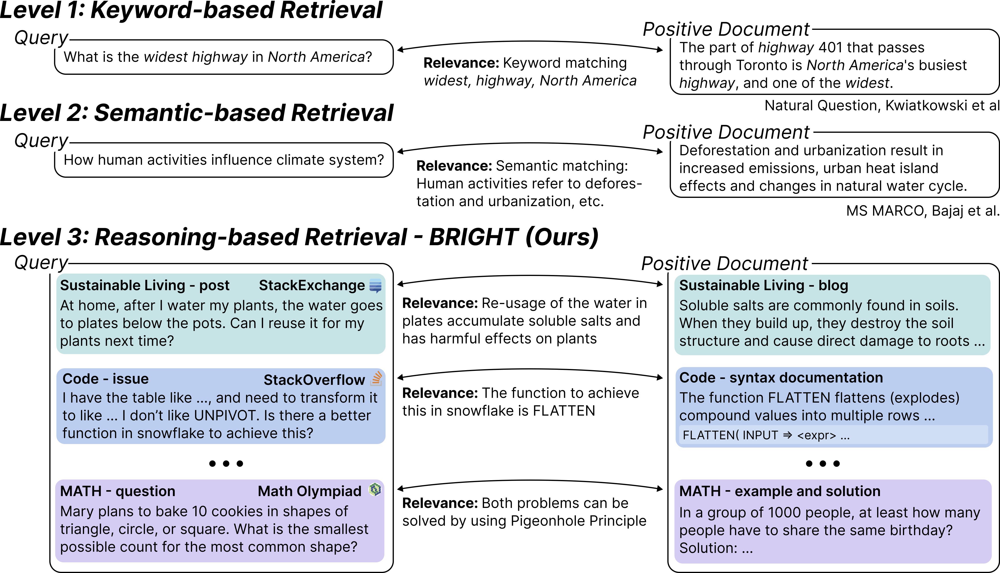

[//]: # (# BRIGHT: A Realistic and Challenging Benchmark for Reasoning-Intensive Retrieval)

<p align="center">
  
</p>

<p align="center">
  <a href="https://brightbenchmark.github.io/">Website</a> •
  <a href="https://arxiv.org/abs/2407.12883">Paper</a> •
  <a href="https://huggingface.co/datasets/xlangai/BRIGHT">Data(4k downloads)</a>
</p>

<p align="center">
    <a href="https://github.com/xlang-ai/BRIGHT/issues">
        
    </a>
    <a href="https://img.shields.io/github/last-commit/xlang-ai/BRIGHT?color=green">
        
    </a>
    <a href="https://github.com/xlang-ai/BRIGHT?tab=CC-BY-4.0-1-ov-file#readme">
        
    </a>
    <br/>
</p>

[//]: # (<p>)

[//]: # (Existing retrieval benchmarks primarily consist of information-seeking queries &#40;e.g., aggregated questions from search engines&#41; where keyword or semantic-based retrieval is usually sufficient. However, many real-world, complex queries necessitate in-depth reasoning to identify relevant documents that go beyond surface form matching. For example, finding documentation for a coding question requires understanding the logic and syntax of the functions involved. We introduce BRIGHT to better benchmark retrieval on such challenging and realistic scenarios.)

[//]: # (</p>)

<p align="center">
    
</p>

## 📢 Updates
- 2024-07-15: We released our [paper](https://brightbenchmark.github.io/), [code](https://github.com/xlang-ai/BRIGHT), and [data](https://huggingface.co/datasets/xlangai/BRIGHT). Check it out!


<!--
This repository contains the code for our paper BRIGHT: A Realistic and Challenging Benchmark for Reasoning-Intensive Retrieval.

We introduce BRIGHT, the first text retrieval benchmark that requires intensive reasoning to retrieve relevant documents. We collect 1,385 real-world queries from diverse domains (StackExchange, LeetCode, and math competitions), sourced from naturally occurring or carefully curated human data. We pair these queries with web pages linked in StackExchange answers, tagged theorems in math Olympiad questions—-all of which require deliberate reasoning to identify the connections.
-->

## 💾 Installation
In your local machine, we recommend to first create a virtual environment:
```bash
conda create -n bright python=3.10
conda activate bright
git clone https://github.com/xlang-ai/BRIGHT
cd BRIGHT
pip install -r requirements.txt
```
That will create the environment bright with all the required packages installed.

## 🤗 Data
BRIGHT comprises 12 diverse datasets, spanning biology, economics, robotics, math, code and more. 
The queries can be long StackExchange posts, math or code question. 
The documents can be blogs, news, articles, reports, etc.
See [Huggingface page](https://huggingface.co/datasets/xlangai/BRIGHT) for more details.

## 📊 Evaluation
We evaluate 13 representative retrieval models of diverse sizes and architectures. Run the following command to get results:
```
python run.py --task {task} --model {model}
```
* `--task`: the task/dataset to evaluate. It can take one of `biology`,`earth_science`,`economics`,`psychology`,`robotics`,`stackoverflow`,`sustainable_living`,`leetcode`,`pony`,`aops`,`theoremqa`, 
* `--model`: the model to evaluate. Current implementation supports `bm25`,`cohere`,`e5`,`google`,`grit`,`inst-l`,`inst-xl`,`openai`,`qwen`,`sbert`,`sf`,`voyage` and `bge`. \
Optional:
* `--long_context`: whether to evaluate on the long-context setting, default to `False`
* `--query_max_length`: the maximum length for the query
* `--doc_max_length`: the maximum length for the document
* `--encode_batch_size`: the encoding batch size
* `--output_dir`: the directory to output results
* `--cache_dir`: the directory to cache document embeddings
* `--config_dir`: the directory of instruction configurations
* `-checkpoint`: the specific checkpoint to use
* `--key`: key for proprietary models
* `--debug`: whether to turn on the debug mode and load only a few documents

### 🔍 Add custom model?
It is very easy to add evaluate custom models on BRIGHT. Just implement the following function in `retrievers.py` and add it to the mapping `RETRIEVAL_FUNCS`:
```python
def retrieval_model_function_name(queries,query_ids,documents,doc_ids,excluded_ids,**kwargs):
    ...
    return scores
```
where `scores` is in the format:
```bash
{
  "query_id_1": {
    "doc_id_1": score_1,
    "doc_id_2": score_2,
    ...
    "doc_id_n": socre_n
  },
  ...
  "query_id_m": {
    "doc_id_1": score_1,
    "doc_id_2": score_2,
    ...
    "doc_id_n": socre_n
  }
}
```

## ❓Bugs or questions?
If you have any question related to the code or the paper, feel free to email Hongjin (hjsu@cs.hku.hk), Howard (hyen@cs.princeton.edu) or Mengzhou (mengzhou@cs.princeton.edu). Please try to specify the problem with details so we can help you better and quicker.

## Citation
If you find our work helpful, please cite us:
```citation
@misc{BRIGHT,
  title={BRIGHT: A Realistic and Challenging Benchmark for Reasoning-Intensive Retrieval},
  author={Su, Hongjin and Yen, Howard and Xia, Mengzhou and Shi, Weijia and Muennighoff, Niklas and Wang, Han-yu and Liu, Haisu and Shi, Quan and Siegel, Zachary S and Tang, Michael and Sun, Ruoxi and Yoon, Jinsung and Arik, Sercan O and Chen, Danqi and Yu, Tao},
  url={https://arxiv.org/abs/2407.12883},
  year={2024},
}
```


